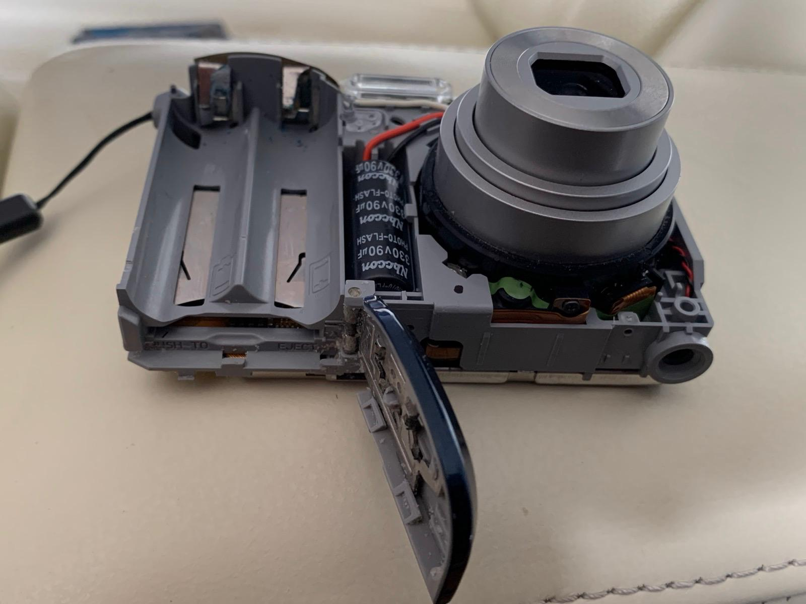
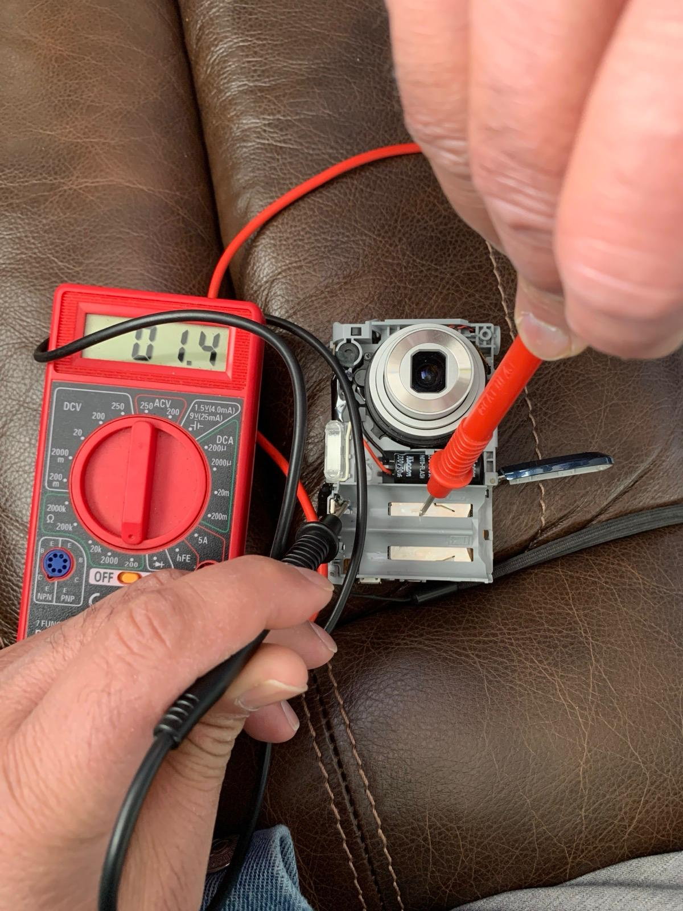
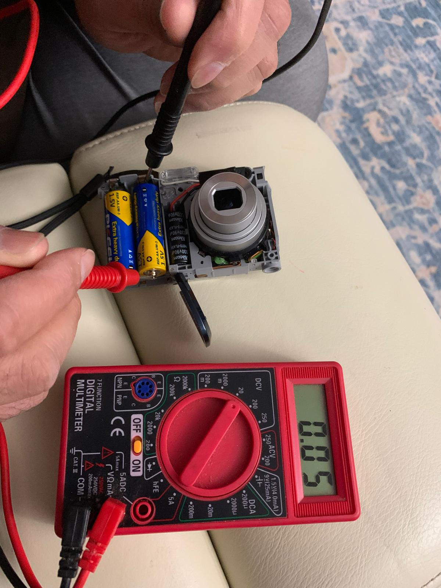
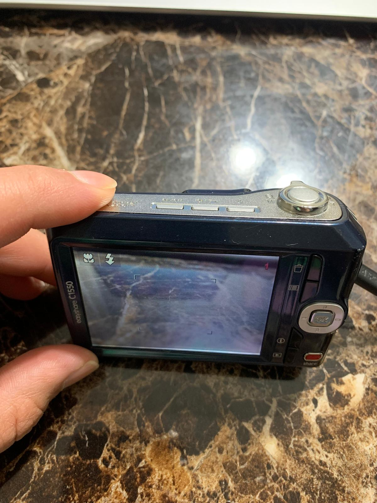

# Hardware Troubleshooting – Kodak C1550 Repair

## 📌 Project Overview
This project documents the troubleshooting and repair process of a Kodak EasyShare C1550 digital camera that failed to power on after being stored with batteries inside for several years.

The issue was caused by battery corrosion damaging the power terminals.

---

## 🧠 Problem Statement
Camera would not power on.

Possible causes:
- Dead batteries
- Broken power switch
- Internal board failure
- Corroded battery terminals

---

## 🔍 Troubleshooting Process

### 1️⃣ Visual Inspection

Corrosion was found on the battery terminals.

---

### 2️⃣ Continuity Test

Used a digital multimeter to verify continuity across battery terminals after cleaning.

Result: ~0.9Ω (Good connection)

---

### 3️⃣ Voltage Test

Measured DC voltage from battery supply to board.

Each AA battery: ~1.6V  
Total expected supply: ~3.0V  

Confirmed voltage reaching internal circuit.

---

### 4️⃣ Cleaning & Restoration

- Removed corrosion residue
- Re-cleaned terminals
- Ensured proper metal contact

---

## ✅ Final Result

Camera powered on successfully after restoration.

---

## 🛠 Skills Demonstrated

- Hardware diagnostics
- Electrical continuity testing
- Voltage measurement
- Power path troubleshooting
- Root cause analysis
- Logical fault isolation
- Physical repair & verification

---

## 🎯 Outcome

Restored a non-functional digital camera to full working condition by diagnosing and repairing power terminal corrosion.
